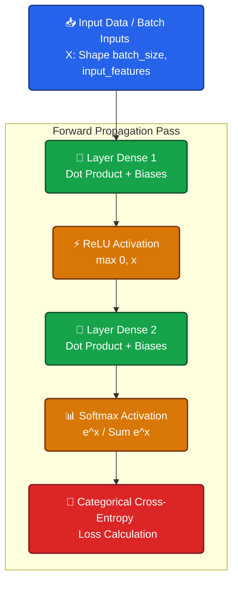

<div align="center">

# 🧠 Neural Networks from Scratch

[](https://www.python.org/)
[](https://numpy.org/)
[](#)

*A ground-up implementation of fundamental Neural Network concepts using pure Python and NumPy.*

</div>

## 📌 Summary
This project is an educational deep dive into the internal mathematics and architecture of neural networks. Instead of relying on high-level machine learning libraries like TensorFlow or PyTorch, this repository builds the core components from scratch. It is designed to help developers and researchers understand the "black box" of AI by sequentially building up from a single neuron to multi-layer, object-oriented architectures with activation and loss functions.

## 🛠 Tech Stack
- **Language:** Python 3
- **Core Library:** NumPy (for optimized matrix operations)
- **Mathematical Operations:** Built-in `math` module
- **Concepts:** Linear Algebra (Dot Products, Matrix Transposition), Object-Oriented Programming (OOP), Forward Propagation, Activation Functions, Loss Functions.

---

## 🏛 Architecture & Data Flow

Below is the visual architecture representing the flow of data across multiple neural network layers and activations. 



---

## 🚀 The Learning Journey (Codebase Deep Dive)

The project directories represent a step-by-step evolutionary process of computing Neural Networks.

| Step | Module | Description | Key Concept |
| :--- | :--- | :--- | :--- |
| **1** | `single_neuron.py` | The most atomic unit of a neural network. Computes the sum of products of inputs and weights, shifted by a bias offset. | $Output = (Input \cdot Weight) + Bias$ |
| **2** | `multiple_neuron.py` | Scales the logic from one neuron to a complete "layer" using iterative loops and `np.dot()` for optimization. | Dot Products |
| **3** | `multiple_batch_inputs_single_layer.py` | Introduces **batches**. Parallel inputs pass into neurons simultaneously using matrix transposition. | Matrix Transposition |
| **4** | `Multiple_layer_neuron.py` | Chains the computations. The 2D matrix produced by Layer 1 naturally flows entirely into the inputs of Layer 2. | Forward Pass chaining |
| **5** | `multilayer_neuron_using_OOPs.py` | Abstracting procedural structures into reusable components using Python classes. | Object-Oriented ML |
| **6** | `activation_function.py` | Introduces non-linearity to map complex functions using the **Rectified Linear Unit (ReLU)**. | ReLU Activation |
| **7** | `softmax_activation.py` | Scales final outputs into probability distributions bounding within `[0.0, 1.0]` with overflow protection. | Softmax Math |
| **8** | `categorical_cross_entropy.py` | Concludes forward propagation with model evaluation using Logarithmic Loss calculations and One-Hot Encoding. | Loss Calculation |

---

## 💻 Installation & Usage

### Prerequisites
Ensure you have Python 3 and NumPy installed on your local machine.

```bash
# Clone the repository
git clone <your-repo-url>
cd Neural_Networks_from_Scratch

# Install dependencies
pip install numpy
```

### Running the Code
You can run any of the Python files directly to see console output demonstrating mathematical correctness at each stage:

```bash
# Example: Running the OOP implementation
python multilayer_neuron_using_OOPs.py

# Example: Testing Softmax activation
python softmax_activation.py
```

---

## 💡 Key Takeaways
By reading through this codebase, you will deeply understand:
- How weights and biases shape data geometry.
- Why Matrix Multiplication is vital for AI scaling and performance.
- How activation functions (ReLU, Softmax) allow neural networks to solve non-linear problems.
- How to measure a model's inaccuracy using Categorical Cross-Entropy Loss.

<div align="center">
  <i>Built with ❤️ for educational purposes.</i>
</div>
